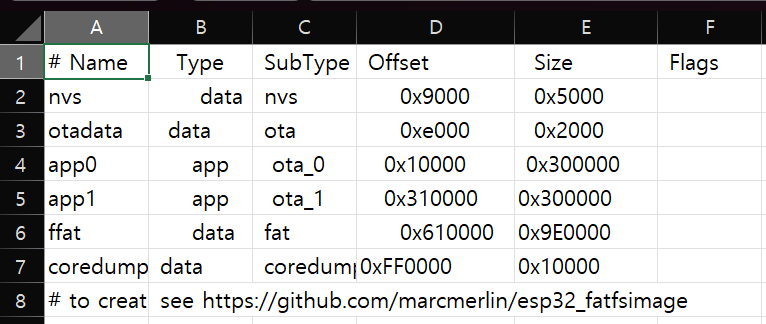
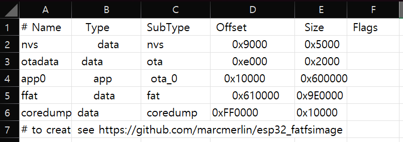
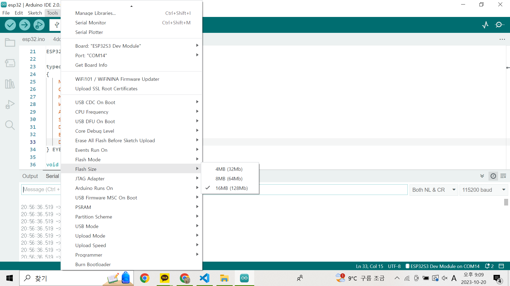
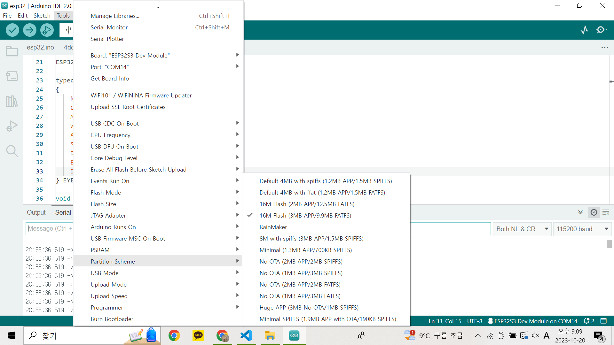

# Setup

## Hardware

1. [ESP32-S3-WROOM-1 개발보드](https://smartstore.naver.com/bneware/products/6729229592)  
   1. N16R8 : FLASH 16MB, PSRAM 8MB  
2. [MQ-7 일산화탄소 가스 센서 모듈](https://www.devicemart.co.kr/goods/view?no=1327402)  
3. [A02YYUW 초음파 센서](https://wiki.dfrobot.com/_A02YYUW_Waterproof_Ultrasonic_Sensor_SKU_SEN0311)

## Dev Env
1. Arduino IDE
2. Arduino Library
   1. [AX-12A](https://github.com/likhogub/AX-12A-servo-library/tree/master)
   2. [MQSensorsLib](https://github.com/miguel5612/MQSensorsLib)
   3. [TFT_eSPI](https://github.com/Bodmer/TFT_eSPI.git)

## Custom Setting

### APP size 변경 (3MB -> 6MB)

- [arduino-esp32 package](https://github.com/espressif/arduino-esp32/releases)  

1. app3M_fat9M_16MB.csv 수정
   1. 파일 경로
      1. C:\Users\USER_NAME\AppData\Local\Arduino15\packages\esp32\hardware\esp32\VERSION\tools\partitions
   2. app1 삭제, app0 size 0x600000 수정
      1. 변경 전  
           
      2. 변경 후  
           
2. boards.txt 수정
   1. 파일 경로
      1. C:\Users\USER_NAME\AppData\Local\Arduino15\packages\esp32\hardware\esp32\VERSION\boards.txt
   2. upload.maximum_size 수정
      1. 변경 전 : esp32s3.menu.PartitionScheme.app3M_fat9M_16MB.upload.maximum_size=`3145728`
      2. 변경 후 : esp32s3.menu.PartitionScheme.app3M_fat9M_16MB.upload.maximum_size=`6291456`
3. Arduino IDE 설정
   1. Tools -> Flash Size -> 16MB
      
   2. Tools -> Partition Schemoe -> 16M Flash (3MB APP/9.9MB FATFS)
      
4. Arduino IDE 다시 시작

## ESP32_M Pin Wiring

|           |     | Dev Board |     |     |      |          |                |
| --------- | --- | --------- | --- | --- | ---- | -------- | -------------- |
|           |     | 3.3V      |     |     | GND  |          |                |
|           |     | 3.3V      |     |     | TXD0 | UART0 TX | Opi TX (USB-C) |
|           |     | RST(EN)   |     |     | RXD0 | UART0 RX | Opi RX (USB-C) |
|           |     | IO4       |     |     | IO1  |UART1 RX/TX| Neck TX / RX   |
|           |     | IO5       |     |     | IO2  |          |                |
|  터치 센서  |     | IO6       |     |     | IO42 |          |                |
|  터치 센서  |     | IO7       |     |     | IO41 |          |                |
|  터치 센서  |     | IO15      |     |     | IO40 | UART3 TX | ESP_S TX       |
|           | ADC | IO16      |     |     | IO39 | UART3 RX | ESP_S RX       |
| 가스 센서 | ADC | IO17      |     |     | IO38 |          |                |
|           |     | IO18      |     |     | IO37 | PSRAM    |                |
|           |     | IO8       |     |     | IO36 | PSRAM    |                |
|           |     | IO3       |     |     | IO35 | PSRAM    |                |
|           |     | IO46      |     |     | IO0  |          |                |
|           |     | IO9       |     |     | IO45 |          |                |
| L 눈      | CS  | IO10      |     |     | IO48 | 컬러LED  |                |
| 눈        | RST | IO11      |     |     | IO47 |          |                |
| R 눈      | CS  | IO12      |     |     | IO21 | DC       | 눈             |
| 눈        | DIN | IO13      |     |     | IO20 |          |                |
| 눈        | CLK | IO14      |     |     | IO19 |          |                |
|           |     | VIN(5V)   |     |     | GND  |          |                |
|           |     | GND       |     |     | GND  |          |                |

## ESP32_S Pin Wiring

|                |       | Dev Board |     |     |      |          |                 |
| -------------- | ----- | --------- | --- | --- | ---- | -------- | --------------- |
|                |       | 3.3V      |     |     | GND  |          |                 |
|                |       | 3.3V      |     |     | TXD0 | UART0 TX | USB-C           |
|                |       | RST(EN)   |     |     | RXD0 | UART0 RX | USB-C           |
|                |       | IO4       |     |     | IO1  | UART1 TX | Ultrasonic 1 TX |
|                |       | IO5       |     |     | IO2  | UART1 RX | Ultrasonic 1 RX |
| ESP32_M        | UART1 | IO6       |     |     | IO42 | UART2 TX | Ultrasonic 2 TX |
| ESP32_M        | UART1 | IO7       |     |     | IO41 | UART2 RX | Ultrasonic 2 RX |
|                |       | IO15      |     |     | IO40 |   I2C    | Current Sensor |
|                |       | IO16      |     |     | IO39 |   I2C    | Current Sensor  |
|                |       | IO17      |     |     | IO38 |          |                 |
|                |       | IO18      |     |     | IO37 | PSRAM    |                 |
|                |       | IO8       |     |     | IO36 | PSRAM    |                 |
|                |       | IO3       |     |     | IO35 | PSRAM    |                 |
|                |       | IO46      |     |     | IO0  |          |                 |
|                |       | IO9       |     |     | IO45 |          |                 |
|                |       | IO10      |     |     | IO48 | 컬러LED  |                 |
| GPS TX         | I2C1  | IO11      |     |     | IO47 |          |                 |
| GPS RX         | I2C1  | IO12      |     |     | IO21 |          |                 |
|                |       | IO13      |     |     | IO20 |          |                 |
|                |       | IO14      |     |     | IO19 |          |                 |
|                |       | VIN(5V)   |     |     | GND  |          |                 |
|                |       | GND       |     |     | GND  |          |                 |
