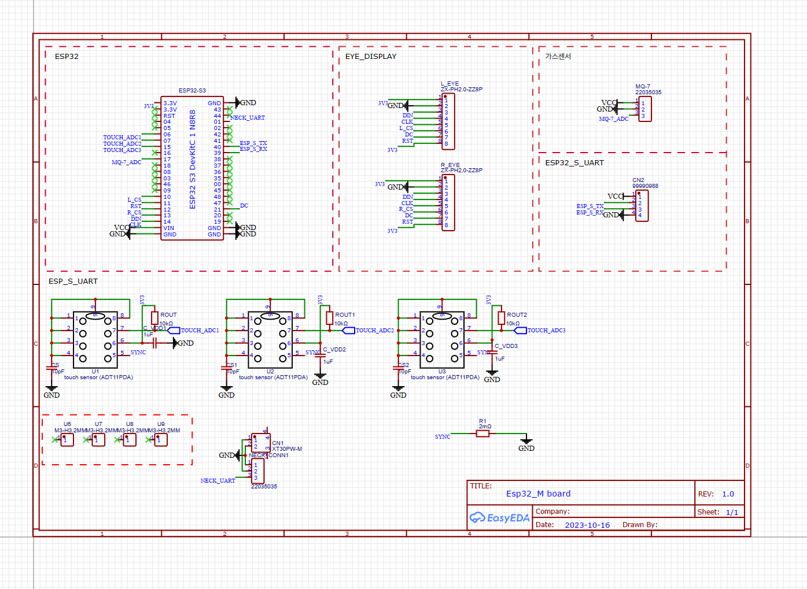

# ESP_M

## Component
1. [ESP32-S3-WROOM-1 개발보드](https://smartstore.naver.com/bneware/products/6729229592)  
   1. N16R8 : FLASH 16MB, PSRAM 8MB  
2. [1.28inch Touch LCD](https://www.waveshare.com/wiki/1.28inch_Touch_LCD#Overview) x 2
3. [터치센서 (ADT11PDA)](https://www.devicemart.co.kr/goods/view?no=1341739) x 3
4. [MQ-7 일산화탄소 가스 센서 모듈](https://www.devicemart.co.kr/goods/view?no=1327402)

## Pin Map

|           |     | Dev Board |     |     |      |             |                |
| --------- | --- | --------- | --- | --- | ---- | ----------- | -------------- |
|           |     | 3.3V      |     |     | GND  |             |                |
|           |     | 3.3V      |     |     | TXD0 | UART0 TX    | Opi TX (USB-C) |
|           |     | RST(EN)   |     |     | RXD0 | UART0 RX    | Opi RX (USB-C) |
|           |     | IO4       |     |     | IO1  | UART1 RX/TX | Neck TX / RX   |
|           |     | IO5       |     |     | IO2  |             |                |
| 터치 센서 | ADC | IO6       |     |     | IO42 |             |                |
| 터치 센서 | ADC | IO7       |     |     | IO41 |             |                |
| 터치 센서 | ADC | IO15      |     |     | IO40 | UART3 TX    | ESP_S TX       |
|           |     | IO16      |     |     | IO39 | UART3 RX    | ESP_S RX       |
| 가스 센서 | ADC | IO17      |     |     | IO38 |             |                |
|           |     | IO18      |     |     | IO37 | PSRAM       |                |
|           |     | IO8       |     |     | IO36 | PSRAM       |                |
|           |     | IO3       |     |     | IO35 | PSRAM       |                |
|           |     | IO46      |     |     | IO0  |             |                |
|           |     | IO9       |     |     | IO45 |             |                |
| L 눈      | CS  | IO10      |     |     | IO48 | 컬러LED     |                |
| 눈        | RST | IO11      |     |     | IO47 |             |                |
| R 눈      | CS  | IO12      |     |     | IO21 | DC          | 눈             |
| 눈        | DIN | IO13      |     |     | IO20 |             |                |
| 눈        | CLK | IO14      |     |     | IO19 |             |                |
|           |     | VIN(5V)   |     |     | GND  |             |                |
|           |     | GND       |     |     | GND  |             |                |

## Schematic
