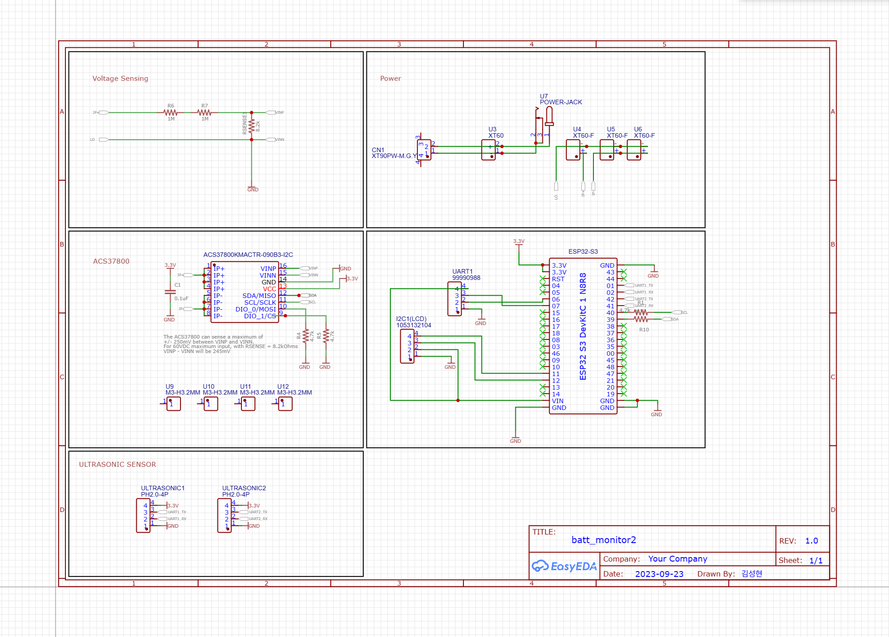

# ESP_S

## Component
1. [ESP32-S3-WROOM-1 개발보드](https://smartstore.naver.com/bneware/products/6729229592)  
   1. N16R8 : FLASH 16MB, PSRAM 8MB  
2. [A02YYUW 초음파 센서](https://wiki.dfrobot.com/_A02YYUW_Waterproof_Ultrasonic_Sensor_SKU_SEN0311) x 2
3. [ACS37800 Power Monitoring IC](https://www.allegromicro.com/en/products/sense/current-sensor-ics/zero-to-fifty-amp-integrated-conductor-sensor-ics/acs37800)
4. [NEO-7M GNSS modules](https://www.u-blox.com/en/product/neo-7-series?legacy=Current#Documentation-&-resources)

## Pin Map

|            |              | Dev Board |     |     |      |          |                             |
| ---------- | ------------ | --------- | --- | --- | ---- | -------- | --------------------------- |
|            |              | 3.3V      |     |     | GND  |          |                             |
|            |              | 3.3V      |     |     | TXD0 | UART0 TX | USB-C                       |
|            |              | RST(EN)   |     |     | RXD0 | UART0 RX | USB-C                       |
|            |              | IO4       |     |     | IO1  | UART1 TX | Ultrasonic 1 RX             |
|            |              | IO5       |     |     | IO2  | UART1 RX | Ultrasonic 1 TX             |
| ESP32_M TX | UART RX (SW) | IO6       |     |     | IO42 | UART2 TX | Ultrasonic 2 RX             |
| ESP32_M RX | UART TX (SW) | IO7       |     |     | IO41 | UART2 RX | Ultrasonic 2 TX             |
|            |              | IO15      |     |     | IO40 | I2C SCL  | Power Monitoring Sensor SCL |
|            |              | IO16      |     |     | IO39 | I2C SDA  | Power Monitoring Sensor SDA |
|            |              | IO17      |     |     | IO38 |          |                             |
|            |              | IO18      |     |     | IO37 | PSRAM    |                             |
|            |              | IO8       |     |     | IO36 | PSRAM    |                             |
|            |              | IO3       |     |     | IO35 | PSRAM    |                             |
|            |              | IO46      |     |     | IO0  |          |                             |
|            |              | IO9       |     |     | IO45 |          |                             |
|            |              | IO10      |     |     | IO48 | 컬러LED  |                             |
| GPS RX     | UART TX (SW) | IO11      |     |     | IO47 |          |                             |
| GPS TX     | UART TX (SW) | IO12      |     |     | IO21 |          |                             |
|            |              | IO13      |     |     | IO20 |          |                             |
|            |              | IO14      |     |     | IO19 |          |                             |
|            |              | VIN(5V)   |     |     | GND  |          |                             |
|            |              | GND       |     |     | GND  |          |                             |

## Schematic
