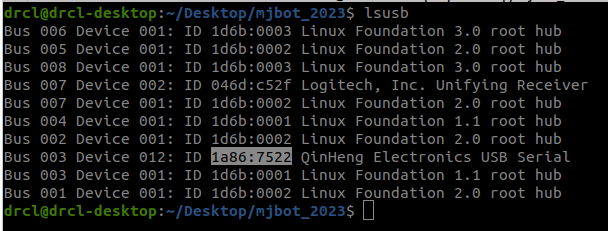

# Setup

## Rename dev/ttyUSB* to dev/esp

1. Vendor, Product ID 확인
    - ```lsusb```   
        
    - Vendor : 1a86
    - Product ID : 7522
    - *esp dev board 변경 시 Product ID 재확인 필요*

2. rule 파일 생성
   1. cd /etc/udev/rules.d
   2. sudo gedit 99-usb-serial.rules (**이름 중복 유의**)

3. rule 파일 작성
    - ```SUBSYSTEM=="tty", ATTRS{idVendor}=="1a86", ATTRS{idProduct}=="7522", SYMLINK+="esp"```
        

4. 장치 제거

5. 적용
   - ```sudo udevadm control --reload-rules```
   - ```sudo service udev reload```
   - ```sudo service udev restart```

6. 확인
   - ```sudo ls -l /dev/esp```  
        


## Bugfix

1. ESP32 CH341-uart converter disconnect `[BUG-SOLVE]`
    - 상황
        - CH341-uart converter 연결됬다가 바로 끊김
            
    - 원인
        - 다른 툴이 통신 방해
    - 해결
        - 그 툴 DISABLE 시킴 
        - ```The problem here is BRLTTY, a program that "provides access to the Linux/Unix console (when in text mode) for a blind person using a refreshable braille display".```
        - https://unix.stackexchange.com/questions/670636/
            
