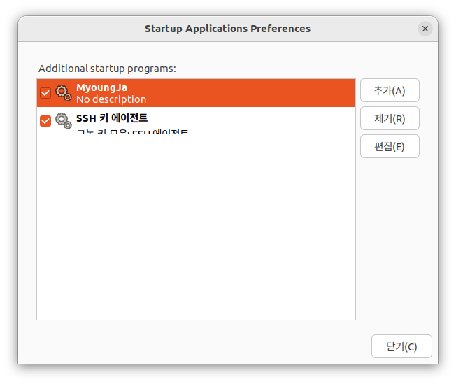
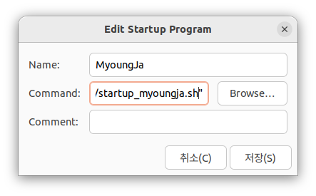

# Setup

## Install ROS2

## Build package

```
./mjbot_2023$ colcon build
./mjbot_2023$ source ./install/setup.bash
```

## Run package

```
ros2 run [package name] [node name]
```

## 부팅 후 MyoungJa Service 자동 실행

1. startup_myoungja.sh 작성 (**유저 네임 유의**)
```
gedit /home/drcl/Desktop/mjbot_2023/startup_myoungja.sh
```
```
#! /bin/bash
source /opt/ros/humble/setup.bash

cd /home/drcl/Desktop/mjbot_2023/
colcon build

source /home/drcl/Desktop/mjbot_2023/install/setup.bash

sleep 2

cd /home/drcl/Desktop/mjbot_2023/
ros2 run opi_esp opi_esp_comm
```

2. Startup Applications 등록

- Startup Applications 실행  
       

- MyoungJa 추가  
      
  
    command
    ```
    gnome-terminal -- /bin/bash -c "/home/drcl/Desktop/mjbot_2023/startup_myoungja.sh"
    ```

3. 재부팅
```
sudo reboot
```
