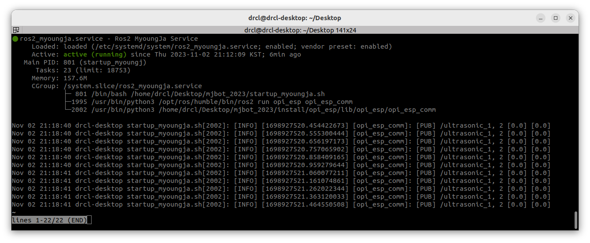

# Setup

## Install ROS2

## Build package

```
./mjbot_2023$ colcon build
./mjbot_2023$ source ./install/setup.bash
```

## Run package

```
ros2 run [package name] [node name]
```

## 부팅 후 MyoungJa Service 자동 실행

1. startup_myoungja.sh 작성 (**유저 네임 유의**)
```
gedit /home/drcl/Desktop/mjbot_2023/startup_myoungja.sh
```
```
#! /bin/bash
source /opt/ros/humble/setup.bash

cd /home/drcl/Desktop/mjbot_2023/
colcon build

source /home/drcl/Desktop/mjbot_2023/install/setup.bash

sleep 2

cd /home/drcl/Desktop/mjbot_2023/
ros2 run opi_esp opi_esp_comm
```

2. ros2_myoungja.service 작성 (**유저 네임 유의**)
```
sudo gedit /etc/systemd/system/ros2_myoungja.service
```
```
# /etc/systemd/system/ros2_myoungja.service
[Unit]
Description=Ros2 MyoungJa Service

[Service]
User = drcl
Type=simple
ExecStart=/home/drcl/Desktop/mjbot_2023/startup_myoungja.sh

[Install]
WantedBy=multi-user.target
```


5. ros2_myoungja.service 등록
```
sudo systemctl daemon-reload
sudo systemctl enable ros2_myoungja.service	# 부팅시 이 서비스를 자동시작 함
sudo systemctl start ros2_myoungja.service	# 서비스 시작
```

6. 재부팅
```
sudo reboot
```

7. ros2_myoungja.service 실행 확인
```
systemctl list-units --type=service
```
```
systemctl status ros2_myoungja.service
```

