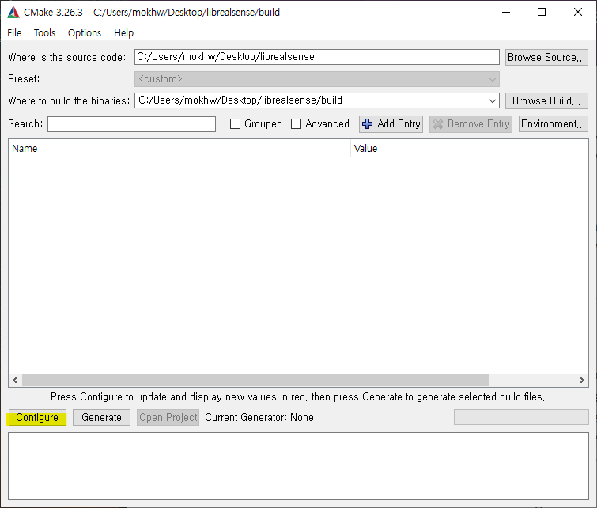
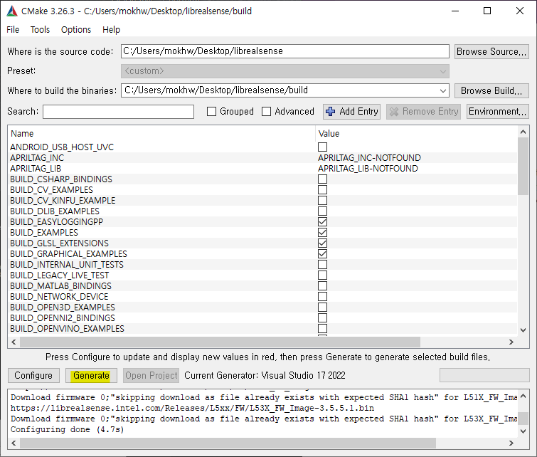

# Run SDK 2.0 example on win10

##  Website
- [How to Run Intel® RealSense™ SDK 2.0 Examples on Visual Studio 2017 on Windows® 10 machine?](https://www.intel.com/content/www/us/en/support/articles/000030463/emerging-technologies/intel-realsense-technology.html)

## Step
1. Install [CMAKE](https://cmake.org/download/)
2. Clone [Intel® RealSense™ SDK 2.0](https://github.com/IntelRealSense/librealsense) using git  
    
3. Run cmake-gui  
    
4. Fill source code & binaries locations  
    
5. Configure  
      
        
    PC에 Visual Studio 2022 버전을 설치해서 2022로 선택함  
      
      
6. Generate  
    
7. Open Project  
    
    
8. Set up as start up project  
    
9. Run align example (F5)  
    
